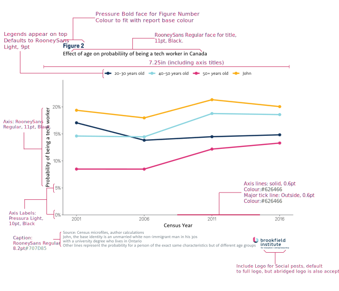

Brookfield Institute Data Visualization Style Guide
================

## Introduction

This package, and associated data visualization style guide lays out the
style elements for data visualization used at the Brookfield Institute.

## Anatomy of a graphic at the Brookfield Institute

## Available graph types in the current version of the package

| Graph Type             | Function                 | Use Cases                                                                          |
|------------------------|--------------------------|------------------------------------------------------------------------------------|
| **Bar graph**          | `plot.column.bf()`       | Comparing single metric across different groups                                    |
| **Scatter graph**      | `plot.scatter.bf()`      | Plot relationship between two metrics across observations                          |
| **Waffle chart**       | `plot.waffle.bf()`       | Represent the shares of different groups in a population                           |
| **Line chart**         | `plot.line.bf()`         | Compare change in metric across multiple period (usually) for different groups     |
| **Pyramid chart**      | `plot.pyramid.bf()`      | Commonly used to represent age pyramid and similar data                            |
| **Mekko chart**        | `plot.mekko.bf()`        | A variant of a bar graph where the width of each bar represents a different metric |
| **Arrow Change chart** | `plot.change.arrow.bf()` | Show change in a metric across two time periods across different groups            |
| **Area chart**         | `plot.area.bf()`         | Used commonly to show how shares of different groups shift over time               |
| **Province map**       | `plot.map.prov.bf()`     | Maps out data at the provincial level                                              |
| **ER map**             | `plot.map.er.bf()`       | Maps out data at the Economic Region level                                         |
| **CMA map**            | `plot.map.cma.bf()`      | Maps out data at the Census Metropolitan Area/Census Agglomeration level           |
| **CSD map**            | `plot.map.csd.bf()`      | Maps out data at the Census Subdivision level                                      |

## Colours

At the Brookfiled Institute, we use three primary colours:

- Magenta: 
  `#dd347a`
- Cyan: 
  `#8ad4df`
- Indigo: 
  `#14365d`

Magenta  is
often used as a highlight colour, in highlighting important data points,
and is not recommended to use as the base colour of comparison.

In addition, we use the following secondary colours:

- Yellow: 
  `#faaf19`
- Green: 
  `#3c7d78`
- Pink: 
  `#ffa5b9`
- Brown: 
  `#c37546`
- Ecru: 
  `#ebe6de`
- Grey: 
  `#626466`

Any graphic will use at least one colour from the primary palette. The
secondary palette should not be used without any colours from the
primary palette. Programmatically, the function that will generate
colours is `set.colours()`. You can specify in a vector the specific
combination of colours you’d like in the order they appear, and pass it
in the `colours` argument in most graphing functions.

    set.colours(3, categorical.choice = c("magenta","ecru","green"))

### Discrete Colour combinations

The following gives suggested colour combinations for specific number of
colours.

#### 2 colours

One from the primary palette + one from secondary. For example:

- Indigo 
  `#14365d` + Green
  
  `#3c7d78`
- Indigo 
  `#14365d` + Ecru
  
  `#ebe6de`
- Magenta 
  `#dd347a` + Grey
  
  `#626466`
- Magenta 
  `#dd347a` + Pink
  
  `#ffa5b9`
- Cyan 
  `#8ad4df` + Green
  
  `#3c7d78`
- Cyan 
  `#8ad4df` + Pink
  
  `#ffa5b9`

#### 3 colours

One primary colour + two secondary colours. For example:

- Indigo 
  `#14365d` + Green
  
  `#3c7d78` + Pink
  
  `#ffa5b9`
- Indigo 
  `#14365d` + Brown
  
  `#c37546` + Ecru
  
  `#ebe6de`
- Cyan 
  `#8ad4df` + Ecru
  
  `#ebe6de` + Grey
  
  `#626466`
- Magenta 
  `#dd347a` + Ecru
  
  `#ebe6de` + Green
  
  `#3c7d78`

#### 4+ colours

When you have more than 4 colours, you are able to use more than one
primary colour, and include gradient as appropriate. Note that you
should never exceed more than 7 separate colours.

- Indigo 
  `#14365d` + Brown
  
  `#c37546` + Pink
  
  `#ffa5b9` + Yellow
  
  `#faaf19`
- Magenta 
  `#dd347a` + Pink
  
  `#ffa5b9` + Cyan
  
  `#8ad4df` + Indigo
  
  `#14365d`

### Colour gradients

In addition to discrete colours, the style guide (and the package),
provide the following gradients that can be used. Gradients are
especially useful in representing data that has a monotonic range
interpretation (for example in heatmaps). Programmatically, you just
need to specify in `set.colours()` how many colours you’re looking for,
and from which gradient you’d like the colours to come from:

    set.colours(5, type = "gradient", gradient.choice="indigo")

In our official style guide, it is recommended that when gradients are
used, the following three are prioritized:

- Indigo: 
  `#14365d`
  
  `#284469`
  
  `#4f6885`
  
  `#4c6282`
  
  `#6f829b`
  
  `#8a9bae`
  
  `#8192a8`
  
  `#94a3b5`
- Green: 
  `#3c7d78`
  
  `#528b86`
  
  `#6d9e9a`
  
  `#679894`
  
  `#7ca6a2`
  
  `#9ebebc`
  
  `#a5c2bf`
  
  `#CEDFDD`
- Grey: 
  `#626466`
  
  `#7d8890`
  
  `#8a949b`
  
  `#939598`
  
  `#9a9fa3`
  
  `#a4acb1`
  
  `#a5abaf`
  
  `#b1b8bc`

However, the package provides the following additional gradients for
used when appropriate:

- Magenta: 
  `#dd347a`
  
  `#e04686`
  
  `#e35892`
  
  `#e66b9e`
  
  `#e97daa`
  
  `#ec90b6`
  
  `#efa2c2`
  
  `#f2b5ce`
- Cyan: 
  `#8ad4df`
  
  `#94d7e1`
  
  `#9fdbe4`
  
  `#a9dfe7`
  
  `#b4e3ea`
  
  `#bfe7ed`
  
  `#c9ebf0`
  
  `#d4eff3`
- Yellow: 
  `#ffc800`
  
  `#ffcd17`
  
  `#ffd22e`
  
  `#ffd745`
  
  `#ffdc5c`
  
  `#ffe173`
  
  `#ffe68b`
  
  `#ffeba2`
- Pink: 
  `#ffa5b9`
  
  `#ffafc1`
  
  `#ffb9c9`
  
  `#ffc3d0`
  
  `#ffccd8`
  
  `#ffd6df`
  
  `#ffdfe7`
  
  `#ffe9ee`
- Brown: 
  `#f7941e`
  
  `#f79d32`
  
  `#f8a746`
  
  `#f9b15b`
  
  `#f9ba6f`
  
  `#fac484`
  
  `#fbce98`
  
  `#fcd8ad`

## Fonts

The Brookfield Institute styleguide uses 2 main family of fonts,
Pressura, and Rooney. The following general conventions will determine
the correct font usage when making non-standard graphics. In general,
default to showing numbers using Pressura (except for cases when the
numbers are integrated inside a text).

- **Figure numbering**: Use Pressura Bold typeface, 13pt
- **Figure title**: Use RooneySans Regular typeface, 11pt
- **Axis titles**: Use RooneySans Regular typeface, 11pt
- **Axis labels**: Use Pressura Light typeface, 10pt
- **Legend title**: Use RooneySans Light typeface, 11pt
- **Legend label**: Use RooneySans Light typeface, 10pt
- **Annotation**: Use RooneySans Regular typeface, appropriate type
  size.

## Installation

As the fonts used by the Brookfield Institute in data visualization is
licensed only for our use - you will notice that those font files are
missing from this public repository. To download the package binary, go
to the Policy Team Resources folder on our Google Drive and you will be
able to find it here. This public version is available for reference
purposes.

Installing the package is fairly straightforward, except for a fact that
if you are working on a Mac, you will have to switch your RStudio
graphical device to Ragg. This ensures that fonts are rendered
correctly.

## Update logs

Current Version: 1.2.0 (updated November 29th 2022)

New in Version 1.2.0

- Added option in plot.line.bf to fit loess line instead of just
  connecting dots

New in Version 1.1.0 (November 4th 2022)

- Added 2021 Census geographies (namely for CMA and CSD). Mapping
  functions default to 2021 geographies.
- Changed pacakge structure slightly, splitting each function into its
  own R file.

New in Version 1.0.1

- Fixed a small bug with plot.column.bf() displaying Rooney font when it
  should be showing Pressura font.
- Ensured every external package reference is updated.

New in Version 1.0.0

- Completely revamped font support - uses showtext now instead of
  extrafont
- Added option to add BIIE logo to generated graphics
- Updated graph styles to match revamped Brookfield style and font guide
  as of August 2022
- Note that for Caption to work properly, R graphical device has to be
  set to RAGG

New in Version 0.3.0

- Add new plot.area.bf Function
- Add options for ordering of column
- Fixes some irregularities in input name for plot.scatter.bf
